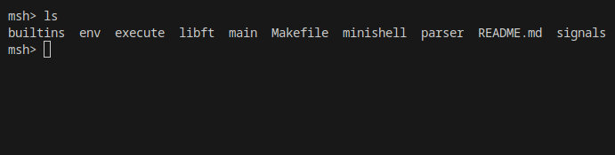

# Minishell - 42 Project
**A Codam (42 Network) Project:** Write a simple shell based on bash



## Build Instructions
```
git clone https://github.com/vockers/minishell.git
cd minishell
make
./minishell
```

## Features
- **Pipes:** |
- **Redirects:** <, >, <<, >>
- **Builtins:** echo, cd, env, unset, pwd, export, exit
- **Enviroment Variables** and **Expansion**
- **History**